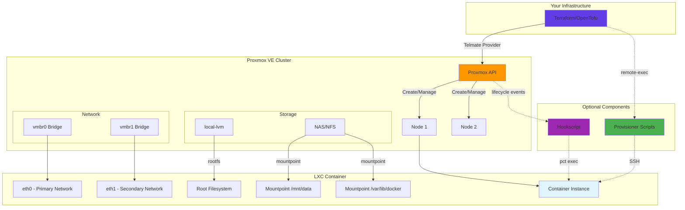

# Terraform Proxmox LXC Module

[](https://github.com/kode3tech/terraform-proxmox-lxc/actions)
[](LICENSE)
[](https://www.terraform.io)
[](https://opentofu.org)
[](https://github.com/pre-commit/pre-commit)
[](https://github.com/kode3tech/terraform-proxmox-lxc/releases)
[](https://github.com/Telmate/terraform-provider-proxmox)

A professional Terraform/OpenTofu module for creating and managing LXC (Linux Container) instances on Proxmox VE using the Telmate/proxmox provider.

**Production-ready** | **Security-first** | **Comprehensive documentation** | **Fully tested**

---

## Table of Contents

- [Features](#features)
- [Requirements](#requirements)
- [Quick Start](#quick-start)
- [Usage](#usage)
- [Examples](#examples)
- [Inputs](#inputs)
- [Outputs](#outputs)
- [Advanced Usage](#advanced-usage)
- [Security](#security)
- [Contributing](#contributing)
- [FAQ](#faq)
- [Support](#support)
- [License](#license)

---

## Features

- **Hostname Validation**: RFC-compliant hostname validation (1-63 characters)
- **Resource Validation**: Input validation for cores, memory, networking, and other configurations
- **Mandatory Tagging**: Automatic tagging with `managed-by=terraform` and `module=lxc`
- **Flexible Networking**: Support for static IP, DHCP, IPv6, VLAN tagging, MTU customization
- **Multiple Network Interfaces**: Support for additional network interfaces beyond eth0
- **Advanced Storage**: Flexible mountpoints with bind, volume, and device mount support
- **Provisioning Support**: Remote command execution via SSH with multiple script modes
- **Hookscript Integration**: Lifecycle automation with Proxmox hookscripts
- **Security First**: Defaults to unprivileged containers, supports SSH key injection
- **OpenTofu Compatible**: Full compatibility with OpenTofu 1.6+
- **Opinionated Defaults**: Sensible defaults for quick deployment

### Architecture Overview



**Key Components:**

- **Terraform/OpenTofu**: Manages infrastructure as code
- **Telmate Provider**: Translates Terraform config to Proxmox API calls
- **Proxmox API**: Controls container lifecycle
- **LXC Container**: The managed container instance
- **Storage**: Root filesystem and additional mountpoints
- **Network**: Multiple network interfaces with VLAN support
- **Provisioners** (optional): SSH-based configuration automation
- **Hookscripts** (optional): Perl scripts for lifecycle events

## Requirements

| Name | Version |
|------|---------|
| <a name="requirement_terraform"></a> [terraform](#requirement\_terraform) | >= 1.6.0 |
| <a name="requirement_opentofu"></a> [opentofu](#requirement\_opentofu) | >= 1.6.0 |
| <a name="requirement_proxmox"></a> [proxmox](#requirement\_proxmox) | 3.0.2-rc07 |
| <a name="requirement_null"></a> [null](#requirement\_null) | >= 3.0 |

**Provider Details:**
- **Telmate/proxmox**: This module uses the community Proxmox provider. Version `3.0.2-rc07` is tested and recommended.
- **Proxmox VE**: Compatible with Proxmox VE 8.x and 9.x
- **OpenTofu**: Full compatibility with OpenTofu 1.6.0 and higher as a drop-in Terraform replacement

**Note:** OpenTofu can be used as a complete Terraform replacement. All examples and configurations work with both tools.

## Proxmox Permissions

The Proxmox API token/user needs the following permissions. Use the appropriate command for your Proxmox VE version:

### Proxmox VE 9.x and Newer

```bash
pveum role add TerraformProv -privs "Datastore.AllocateSpace Datastore.Audit VM.Allocate VM.Audit VM.Config.CDROM VM.Config.Cloudinit VM.Config.CPU VM.Config.Disk VM.Config.Memory VM.Config.Network VM.Config.Options VM.PowerMgmt SDN.Use Sys.Audit Sys.Console Sys.Modify"
pveum user add terraform-prov@pve --password <password>
pveum aclmod / -user terraform-prov@pve -role TerraformProv
```

**Note:** In Proxmox 9, the `VM.Monitor` privilege was deprecated and is no longer required.

### Proxmox VE 8.x and Older

```bash
pveum role add TerraformProv -privs "Datastore.AllocateSpace Datastore.Audit VM.Allocate VM.Audit VM.Config.CDROM VM.Config.Cloudinit VM.Config.CPU VM.Config.Disk VM.Config.Memory VM.Config.Network VM.Config.Options VM.Monitor VM.PowerMgmt SDN.Use Sys.Audit Sys.Console Sys.Modify"
pveum user add terraform-prov@pve --password <password>
pveum aclmod / -user terraform-prov@pve -role TerraformProv
```

### API Token (Recommended)

For enhanced security, use an API token instead of a password:

```bash
pveum user token add terraform-prov@pve mytoken
```

This will output the token ID and secret. Use them in your environment variables:

```bash
export PM_API_TOKEN_ID='terraform-prov@pve!mytoken'
export PM_API_TOKEN_SECRET="<your-token-secret>"
```

---

## Quick Start

### 1. Configure Provider

```bash
export PM_API_URL="https://proxmox.example.com:8006/api2/json"
export PM_API_TOKEN_ID="terraform@pam!mytoken"
export PM_API_TOKEN_SECRET="your-secret-token"
```

### 2. Basic Container

```hcl
module "web_container" {
  source = "github.com/kode3tech/terraform-proxmox-lxc?ref=v1.0.0"

  # Required
  hostname    = "web-server-01"
  target_node = "pve-node01"
  ostemplate  = "local:vztmpl/ubuntu-22.04-standard_22.04-1_amd64.tar.zst"

  # Network
  network_bridge = "vmbr0"
  network_ip     = "dhcp"  # Or static: "192.168.1.100/24"

  # Storage
  rootfs_storage = "local-lvm"
  rootfs_size    = "10G"
}
```

### 3. Deploy

```bash
terraform init
terraform plan
terraform apply
```

**For detailed examples, see the [examples/](examples/) directory.**

---

## Usage

### Basic Example

```hcl
module "web_container" {
  source = "github.com/kode3tech/terraform-proxmox-lxc?ref=v1.0.0"

  # Required
  hostname    = "app-dev-web-01"
  target_node = "pve-node01"
  ostemplate  = "local:vztmpl/ubuntu-22.04-standard_22.04-1_amd64.tar.zst"

  # Resources
  cores  = 2
  memory = 2048
  swap   = 1024

  # Storage
  rootfs_storage = "local-lvm"
  rootfs_size    = "10G"

  # Network
  network_bridge  = "vmbr0"
  network_ip      = "192.168.1.100/24"
  network_gateway = "192.168.1.1"

  # SSH access
  ssh_public_keys = file("~/.ssh/id_rsa.pub")

  # Tags
  tags = {
    project = "web-app"
    owner   = "devops-team"
  }
}
```

### Provider Configuration

Set environment variables for authentication:

```bash
export PM_API_URL="https://proxmox.example.com:8006/api2/json"
export PM_API_TOKEN_ID="terraform@pam!your-token-id"
export PM_API_TOKEN_SECRET="your-secret-token"
```

Or configure in your Terraform code:

```hcl
provider "proxmox" {
  pm_api_url          = "https://proxmox.example.com:8006/api2/json"
  pm_api_token_id     = "terraform@pam!your-token-id"
  pm_api_token_secret = var.proxmox_token_secret
  pm_tls_insecure     = false
}
```

---

## Hostname Validation

The module validates hostnames according to RFC standards:

**Constraints**:
- Must be 1-63 characters long
- Must start and end with alphanumeric characters (lowercase)
- Can contain only lowercase letters, numbers, and hyphens
- Cannot contain consecutive hyphens

**Valid Examples**:
- `web-server-01`
- `app-dev-database`
- `nginx-proxy`

**Invalid Examples**:
- `-invalid-start` (starts with hyphen)
- `invalid-end-` (ends with hyphen)
- `UPPERCASE` (contains uppercase)
- `invalid_underscore` (contains underscore)

## Tagging

All containers are automatically tagged with mandatory tags:
- `managed-by = "terraform"`
- `module = "lxc"`

Additional tags can be provided via the `tags` variable and will be merged with mandatory tags.

**Example**:
```hcl
tags = {
  environment = "production"
  team        = "devops"
  project     = "web-platform"
}
```

## Provisioner Support

The module supports automatic container configuration via SSH after creation. There are three execution modes:

### 1. Inline Commands

Execute simple commands directly:

```hcl
module "container" {
  # ... basic config ...

  provisioner_enabled         = true
  provisioner_ssh_private_key = file("~/.ssh/id_rsa")
  provisioner_commands = [
    "apt-get update",
    "apt-get install -y docker.io",
  ]
}
```

### 2. Single Script File

Execute a single external script:

```hcl
module "container" {
  # ... basic config ...

  provisioner_enabled         = true
  provisioner_ssh_private_key = file("~/.ssh/id_rsa")
  provisioner_script_path     = "${path.module}/scripts/setup.sh"
}
```

### 3. Multiple Scripts (Directory)

Execute multiple scripts in controlled order:

```hcl
module "container" {
  # ... basic config ...

  provisioner_enabled         = true
  provisioner_ssh_private_key = file("~/.ssh/id_rsa")
  provisioner_scripts_dir     = "${path.module}/scripts"
}
```

**Script naming for order control:**
```
scripts/
  01-update-system.sh
  02-install-docker.sh
  03-configure-app.sh
```

Scripts are executed in lexicographic (alphabetical) order. Use numeric prefixes to guarantee execution sequence.

### Requirements for Provisioners

⚠️ **IMPORTANT**: Provisioners require:

1. **Static IP** - DHCP is NOT supported (Terraform needs IP during planning phase)
2. **SSH Keys** - Both public key (in container) and private key (for connection)
3. **POSIX Shell** - Scripts must use `/bin/sh`, not bash-specific features

### Provisioner Examples

See detailed examples:
- [Single Script](examples/provisioner) - One script file with Docker installation
- [Multiple Scripts](examples/provisioner-multi-scripts) - Directory with ordered scripts

For alternative approaches, see [Hookscript Example](examples/hookscript) which runs on Proxmox host instead of container.

## Examples

See the [examples/basic](examples/basic) directory for a complete working example.

To test the example:

```bash
cd examples/basic
terraform init
terraform plan
terraform apply
```

## Limitations

Current known limitations of this module:

- **Provisioner DHCP Restriction**: Remote provisioners (SSH-based) cannot be used with DHCP networking. Static IP is required for provisioning to ensure reliable SSH connectivity.
- **Provider Constraints**: Limited by the capabilities of the Telmate/proxmox provider (version 3.0.2-rc07)
- **Single Container per Module Instance**: The module creates one LXC container per invocation. Use multiple module blocks for multiple containers.

**What IS Supported:**
- ✅ Multiple network interfaces (eth0, eth1, eth2, etc.) via `additional_networks`
- ✅ Multiple mountpoints (bind mounts, volumes, devices) via `mountpoints`
- ✅ High Availability configuration via `hastate` and `hagroup`
- ✅ Hookscripts for lifecycle automation
- ✅ Three provisioning modes (inline commands, single script, multiple scripts)
- ✅ IPv4 and IPv6 networking with VLAN support
- ✅ Container features (nesting, FUSE, NFS/CIFS, keyctl)

## Contributing

This module follows strict design principles:
- Single responsibility (LXC containers only)
- Minimal interface with opinionated defaults
- All inputs must have validation
- Changes must maintain backward compatibility (or bump MAJOR version)

## License

MIT

## Authors

Infrastructure Team
<!-- BEGINNING OF PRE-COMMIT-TERRAFORM DOCS HOOK -->
## Requirements

| Name | Version |
|------|---------|
| <a name="requirement_terraform"></a> [terraform](#requirement\_terraform) | >= 1.6.0 |
| <a name="requirement_null"></a> [null](#requirement\_null) | >= 3.0 |
| <a name="requirement_proxmox"></a> [proxmox](#requirement\_proxmox) | 3.0.2-rc07 |

## Providers

| Name | Version |
|------|---------|
| <a name="provider_null"></a> [null](#provider\_null) | 3.2.4 |
| <a name="provider_proxmox"></a> [proxmox](#provider\_proxmox) | 3.0.2-rc07 |

## Modules

No modules.

## Resources

| Name | Type |
|------|------|
| [null_resource.provisioner](https://registry.terraform.io/providers/hashicorp/null/latest/docs/resources/resource) | resource |
| proxmox_lxc.this | resource |

## Inputs

| Name | Description | Type | Default | Required |
|------|-------------|------|---------|:--------:|
| <a name="input_additional_networks"></a> [additional\_networks](#input\_additional\_networks) | Additional network interfaces beyond eth0. Each network must have a unique name (eth1, eth2, etc.) | <pre>list(object({<br>    name     = string           # Interface name (e.g., "eth1", "eth2")<br>    bridge   = string           # Bridge to attach to (e.g., "vmbr1")<br>    ip       = optional(string) # IPv4 address in CIDR or "dhcp" or "manual"<br>    gw       = optional(string) # IPv4 gateway<br>    ip6      = optional(string) # IPv6 address in CIDR or "auto", "dhcp", "manual"<br>    gw6      = optional(string) # IPv6 gateway<br>    hwaddr   = optional(string) # MAC address<br>    mtu      = optional(number) # MTU (576-65536)<br>    rate     = optional(number) # Rate limit in Mbps<br>    tag      = optional(number) # VLAN tag<br>    firewall = optional(bool)   # Enable firewall<br>  }))</pre> | `[]` | no |
| <a name="input_arch"></a> [arch](#input\_arch) | Container OS architecture type | `string` | `"amd64"` | no |
| <a name="input_bwlimit"></a> [bwlimit](#input\_bwlimit) | Override I/O bandwidth limit in KiB/s for disk operations | `number` | `null` | no |
| <a name="input_cmode"></a> [cmode](#input\_cmode) | Console mode. 'tty' tries to open tty devices, 'console' attaches to /dev/console, 'shell' invokes a shell. Default is 'tty' | `string` | `"tty"` | no |
| <a name="input_console"></a> [console](#input\_console) | Attach a console device to the container. Default is true | `bool` | `true` | no |
| <a name="input_cores"></a> [cores](#input\_cores) | Number of CPU cores assigned to the container. Container can use all available cores by default | `number` | `null` | no |
| <a name="input_cpulimit"></a> [cpulimit](#input\_cpulimit) | Limit CPU usage by this number. Default 0 means no limit. Set to 2 to limit container to 2 cores worth of CPU time | `number` | `0` | no |
| <a name="input_cpuunits"></a> [cpuunits](#input\_cpuunits) | CPU weight that the container possesses. Used by kernel scheduler to distribute CPU time. Default is 1024 | `number` | `1024` | no |
| <a name="input_description"></a> [description](#input\_description) | Container description seen in the Proxmox web interface | `string` | `""` | no |
| <a name="input_features"></a> [features](#input\_features) | Object for allowing the container to access advanced features (FUSE mounts, nesting, keyctl, allowed mount types) | <pre>object({<br>    fuse    = optional(bool, false)<br>    keyctl  = optional(bool, false)<br>    mount   = optional(string, null)<br>    nesting = optional(bool, false)<br>  })</pre> | `null` | no |
| <a name="input_force"></a> [force](#input\_force) | Allow overwriting of pre-existing containers. Default is false | `bool` | `false` | no |
| <a name="input_hagroup"></a> [hagroup](#input\_hagroup) | HA group identifier the resource belongs to. Requires hastate to be set | `string` | `null` | no |
| <a name="input_hastate"></a> [hastate](#input\_hastate) | Requested HA state for the resource: started, stopped, enabled, disabled, or ignored | `string` | `null` | no |
| <a name="input_hookscript"></a> [hookscript](#input\_hookscript) | Volume identifier to a script that will be executed during various steps in the container's lifetime | `string` | `null` | no |
| <a name="input_hostname"></a> [hostname](#input\_hostname) | Hostname for the LXC container | `string` | n/a | yes |
| <a name="input_memory"></a> [memory](#input\_memory) | Amount of RAM to assign to the container in MB | `number` | `512` | no |
| <a name="input_mountpoints"></a> [mountpoints](#input\_mountpoints) | Additional storage volumes to mount in the container. Supports storage-backed, bind mounts, and device mounts | <pre>list(object({<br>    slot      = string         # Mount point identifier (e.g., "0", "1", "2")<br>    storage   = string         # Storage name, directory path, or device path<br>    mp        = string         # Mount point path inside container (e.g., "/mnt/data")<br>    size      = string         # Size with unit (e.g., "10G", "500M", "1T")<br>    acl       = optional(bool) # Enable ACL support (default: false)<br>    backup    = optional(bool) # Include in backups (default: false)<br>    quota     = optional(bool) # Enable user quotas (default: false)<br>    replicate = optional(bool) # Include in storage replica job (default: false)<br>    shared    = optional(bool) # Mark as available on all nodes (default: false)<br>  }))</pre> | `[]` | no |
| <a name="input_nameserver"></a> [nameserver](#input\_nameserver) | DNS server IP address used by the container. Uses Proxmox host values if not specified | `string` | `null` | no |
| <a name="input_network_bridge"></a> [network\_bridge](#input\_network\_bridge) | Bridge to attach the network interface to (e.g., 'vmbr0') | `string` | `"vmbr0"` | no |
| <a name="input_network_firewall"></a> [network\_firewall](#input\_network\_firewall) | Enable the Proxmox firewall on the network interface | `bool` | `false` | no |
| <a name="input_network_gateway"></a> [network\_gateway](#input\_network\_gateway) | IPv4 address belonging to the network interface's default gateway | `string` | `null` | no |
| <a name="input_network_gw6"></a> [network\_gw6](#input\_network\_gw6) | IPv6 address of the network interface's default gateway | `string` | `null` | no |
| <a name="input_network_hwaddr"></a> [network\_hwaddr](#input\_network\_hwaddr) | Common MAC address with the I/G (Individual/Group) bit not set. Automatically determined if not set | `string` | `null` | no |
| <a name="input_network_ip"></a> [network\_ip](#input\_network\_ip) | IPv4 address of the network interface. Can be static IPv4 (CIDR notation), 'dhcp', or 'manual' | `string` | `"dhcp"` | no |
| <a name="input_network_ip6"></a> [network\_ip6](#input\_network\_ip6) | IPv6 address of the network interface. Can be static IPv6 (CIDR notation), 'auto', 'dhcp', or 'manual' | `string` | `null` | no |
| <a name="input_network_mtu"></a> [network\_mtu](#input\_network\_mtu) | MTU (Maximum Transmission Unit) for the network interface | `number` | `null` | no |
| <a name="input_network_rate"></a> [network\_rate](#input\_network\_rate) | Rate limiting on the network interface in Mbps (Megabits per second) | `number` | `null` | no |
| <a name="input_network_vlan"></a> [network\_vlan](#input\_network\_vlan) | VLAN tag of the network interface. Automatically determined if not set | `number` | `null` | no |
| <a name="input_onboot"></a> [onboot](#input\_onboot) | Specifies whether the container will start on boot. Default is false | `bool` | `false` | no |
| <a name="input_ostemplate"></a> [ostemplate](#input\_ostemplate) | Volume identifier that points to the OS template or backup file (e.g., 'local:vztmpl/ubuntu-22.04-standard\_22.04-1\_amd64.tar.zst') | `string` | n/a | yes |
| <a name="input_ostype"></a> [ostype](#input\_ostype) | OS type used by LXC to set up and configure the container. Automatically determined if not set | `string` | `null` | no |
| <a name="input_password"></a> [password](#input\_password) | Root password inside the container. Use SSH keys instead for better security | `string` | `null` | no |
| <a name="input_pool"></a> [pool](#input\_pool) | Name of the Proxmox resource pool to add this container to | `string` | `null` | no |
| <a name="input_protection"></a> [protection](#input\_protection) | Enable protection flag to prevent the container and its disk from being removed/updated. Default is false | `bool` | `false` | no |
| <a name="input_provisioner_commands"></a> [provisioner\_commands](#input\_provisioner\_commands) | List of commands to execute inside the container after initialization. Requires provisioner\_enabled = true. Mutually exclusive with provisioner\_script\_path | `list(string)` | `[]` | no |
| <a name="input_provisioner_enabled"></a> [provisioner\_enabled](#input\_provisioner\_enabled) | Enable remote-exec provisioner to run commands after container initialization | `bool` | `false` | no |
| <a name="input_provisioner_script_path"></a> [provisioner\_script\_path](#input\_provisioner\_script\_path) | Path to shell script file to execute inside the container after initialization. Mutually exclusive with provisioner\_commands. Script will be read and executed inline | `string` | `null` | no |
| <a name="input_provisioner_scripts_dir"></a> [provisioner\_scripts\_dir](#input\_provisioner\_scripts\_dir) | Directory containing shell scripts (*.sh) to execute sequentially.<br>Scripts are executed in lexicographic order (use numeric prefixes like 01-, 02- to control order).<br>Mutually exclusive with provisioner\_commands and provisioner\_script\_path.<br><br>Example structure:<br>  scripts/<br>    01-update-system.sh<br>    02-install-docker.sh<br>    03-configure-app.sh | `string` | `null` | no |
| <a name="input_provisioner_ssh_host"></a> [provisioner\_ssh\_host](#input\_provisioner\_ssh\_host) | SSH host/IP for remote-exec provisioner. If not provided, will attempt to extract from network\_ip | `string` | `null` | no |
| <a name="input_provisioner_ssh_private_key"></a> [provisioner\_ssh\_private\_key](#input\_provisioner\_ssh\_private\_key) | SSH private key for remote-exec provisioner. Use file() function to read from path: file("~/.ssh/id\_rsa"). Required when provisioner\_enabled = true | `string` | `null` | no |
| <a name="input_provisioner_ssh_user"></a> [provisioner\_ssh\_user](#input\_provisioner\_ssh\_user) | SSH user for remote-exec provisioner. Defaults to 'root' for LXC containers | `string` | `"root"` | no |
| <a name="input_provisioner_timeout"></a> [provisioner\_timeout](#input\_provisioner\_timeout) | Timeout for SSH connection in the provisioner (e.g., '5m', '30s') | `string` | `"5m"` | no |
| <a name="input_restore"></a> [restore](#input\_restore) | Mark the container creation/update as a restore task. Default is false | `bool` | `false` | no |
| <a name="input_rootfs_size"></a> [rootfs\_size](#input\_rootfs\_size) | Size of the root filesystem. Must end in T, G, M, or K (e.g., '8G', '1024M') | `string` | `"8G"` | no |
| <a name="input_rootfs_storage"></a> [rootfs\_storage](#input\_rootfs\_storage) | Storage identifier for the root filesystem (e.g., 'local-lvm', 'local-zfs') | `string` | `"local-lvm"` | no |
| <a name="input_searchdomain"></a> [searchdomain](#input\_searchdomain) | DNS search domain for the container. Uses Proxmox host values if not specified | `string` | `null` | no |
| <a name="input_ssh_public_keys"></a> [ssh\_public\_keys](#input\_ssh\_public\_keys) | Multi-line string of SSH public keys that will be added to the container's authorized\_keys | `string` | `null` | no |
| <a name="input_start"></a> [start](#input\_start) | Specifies whether the container is started after creation. Default is false | `bool` | `true` | no |
| <a name="input_startup"></a> [startup](#input\_startup) | Startup and shutdown behavior (e.g., 'order=1,up=30,down=60'). Defines startup order and delays | `string` | `null` | no |
| <a name="input_swap"></a> [swap](#input\_swap) | Amount of swap memory available to the container in MB. Default is 512 | `number` | `512` | no |
| <a name="input_tags"></a> [tags](#input\_tags) | Additional tags to merge with mandatory module tags (managed-by, module). Tag values will appear in Proxmox UI as tags and full key=value pairs in description. | `map(string)` | `{}` | no |
| <a name="input_target_node"></a> [target\_node](#input\_target\_node) | Name of the Proxmox cluster node where the LXC container will be created | `string` | n/a | yes |
| <a name="input_template"></a> [template](#input\_template) | Enable to mark this container as a template for cloning. Default is false | `bool` | `false` | no |
| <a name="input_tty"></a> [tty](#input\_tty) | Number of TTY (teletypewriter) devices available to the container. Default is 2 | `number` | `2` | no |
| <a name="input_unique"></a> [unique](#input\_unique) | Assign a unique random ethernet address to the container. Default is false | `bool` | `false` | no |
| <a name="input_unprivileged"></a> [unprivileged](#input\_unprivileged) | Makes the container run as an unprivileged user. Recommended for security. Default is false | `bool` | `true` | no |
| <a name="input_vmid"></a> [vmid](#input\_vmid) | VMID for the LXC container. If set to 0 or null, the next available VMID is used | `number` | `null` | no |

## Outputs

| Name | Description |
|------|-------------|
| <a name="output_additional_networks"></a> [additional\_networks](#output\_additional\_networks) | Additional network interfaces configured on the container |
| <a name="output_hostname"></a> [hostname](#output\_hostname) | The hostname of the LXC container |
| <a name="output_id"></a> [id](#output\_id) | The ID of the LXC container resource |
| <a name="output_ipv4_address"></a> [ipv4\_address](#output\_ipv4\_address) | The IPv4 address of the LXC container (if static IP is configured) |
| <a name="output_mountpoints"></a> [mountpoints](#output\_mountpoints) | Additional storage mountpoints configured on the container |
| <a name="output_network_config"></a> [network\_config](#output\_network\_config) | Network configuration applied to the container |
| <a name="output_total_mountpoints"></a> [total\_mountpoints](#output\_total\_mountpoints) | Total number of mountpoints (excluding rootfs) |
| <a name="output_total_networks"></a> [total\_networks](#output\_total\_networks) | Total number of network interfaces (including eth0) |
| <a name="output_vmid"></a> [vmid](#output\_vmid) | The VM ID assigned to the LXC container |
<!-- END OF PRE-COMMIT-TERRAFORM DOCS HOOK -->

## Examples

Explore comprehensive examples demonstrating various use cases:

- **[Basic Example](examples/basic/)** - Simple container deployment with DHCP networking
- **[Advanced Example](examples/advanced/)** - Multi-container setup with static IPs, custom resources, and storage
- **[Provisioner Example](examples/provisioner/)** - Container lifecycle management with remote provisioning scripts
- **[Multi-Script Provisioner](examples/multi-scripts/)** - Advanced provisioning with multiple scripts and file uploads
- **[Hookscript Example](examples/hookscript/)** - Custom lifecycle automation using Proxmox hookscripts

Each example includes detailed README with explanations, prerequisites, and step-by-step deployment instructions.

## Security

Security is a top priority for this module. Please review:

- **[Security Policy](SECURITY.md)** - Vulnerability reporting and security best practices
- **Security Scanning** - This module is continuously scanned using:
  - **tfsec** - Static analysis for Terraform security issues
  - **checkov** - Infrastructure-as-code security scanner
  - **Dependabot** - Automated dependency vulnerability alerts
- **Authentication** - Always use token-based authentication with the Telmate/proxmox provider
- **Secrets Management** - Never commit API credentials; use environment variables or secret management tools

To report a security vulnerability, please see [SECURITY.md](SECURITY.md) for our responsible disclosure process.

## Contributing

Contributions are welcome! Please follow these guidelines:

1. **Fork** the repository
2. **Create** a feature branch (`git checkout -b feature/amazing-feature`)
3. **Commit** your changes using [Conventional Commits](https://www.conventionalcommits.org/)
4. **Test** your changes thoroughly
5. **Submit** a Pull Request

### Development Requirements

- Terraform/OpenTofu >= 1.6
- pre-commit hooks installed (`pre-commit install`)
- tflint for code quality
- terraform-docs for documentation

### Code Quality

This project uses automated tools to ensure code quality:

```bash
# Install pre-commit hooks
pre-commit install

# Run all checks
pre-commit run --all-files

# Format code
terraform fmt -recursive

# Validate configuration
terraform validate

# Run security scanning
tfsec .
checkov -d .
```

### Versioning Policy

This module follows [Semantic Versioning](https://semver.org/) (SemVer):

- **MAJOR** version for incompatible API changes (breaking changes)
- **MINOR** version for backward-compatible new features
- **PATCH** version for backward-compatible bug fixes

**Version Format:** `vMAJOR.MINOR.PATCH` (e.g., `v1.2.3`)

**Release Process:**
1. Update [CHANGELOG.md](CHANGELOG.md) with changes under `[Unreleased]` section
2. When ready to release, move `[Unreleased]` items to new version section
3. Create Git tag: `git tag -a v1.2.3 -m "Release v1.2.3"`
4. Push tag: `git push origin v1.2.3`
5. Create GitHub Release with changelog content

**Breaking Changes:**
- Must increment MAJOR version
- Must be documented in CHANGELOG.md with migration guide
- Must include deprecation warnings in prior MINOR release when possible

**Using Versioned Module:**
```hcl
module "container" {
  source = "github.com/kode3tech/terraform-proxmox-lxc?ref=v1.0.0"
  # ... configuration
}
```

Always pin to a specific version tag in production. See [CHANGELOG.md](CHANGELOG.md) for version history and upgrade instructions.

Please read [CONTRIBUTING.md](CONTRIBUTING.md) (if available) for detailed contribution guidelines.

## FAQ

### General Questions

**Q: Can I use this module with OpenTofu instead of Terraform?**

A: Yes! This module is 100% compatible with OpenTofu 1.6.0+. Simply replace `terraform` commands with `tofu` commands. All examples and configurations work identically.

**Q: What Proxmox VE versions are supported?**

A: This module is tested with Proxmox VE 7.x and 8.x. Proxmox 9.x should work but requires the updated permission set (without `VM.Monitor` which was deprecated).

**Q: Is this module published on the Terraform Registry?**

A: Yes! You can find it on the [Terraform Registry](https://registry.terraform.io/) and use it with standard module syntax.

**Q: Can I use DHCP for container networking?**

A: Yes! Set `network_ip = "dhcp"` for automatic IP assignment. However, **static IPs are required** if you use provisioners (remote-exec) since Terraform needs to SSH into the container.

### Container Configuration

**Q: How do I enable Docker support in my container?**

A: Enable nested virtualization:
```hcl
features {
  nesting = true
}
```
See the [provisioner example](examples/provisioner/) for a complete Docker installation.

**Q: What's the difference between unprivileged and privileged containers?**

A: **Unprivileged containers** (default, `unprivileged = true`) run with user namespace isolation for better security. **Privileged containers** (`unprivileged = false`) run as root and have more permissions but are less secure. Use unprivileged unless you have specific requirements.

**Q: How do I add SSH keys for authentication?**

A: Use the `ssh_public_keys` variable:
```hcl
ssh_public_keys = file("~/.ssh/id_rsa.pub")
```
See [examples/advanced/](examples/advanced/) for complete configuration.

**Q: Can I create multiple network interfaces?**

A: Yes! Use the `network` block. See [examples/advanced/](examples/advanced/) for multi-network configuration examples.

### Provisioning & Automation

**Q: What's the difference between provisioners and hookscripts?**

| Feature | Provisioner (remote-exec) | Hookscript |
|---------|---------------------------|------------|
| **Execution** | Inside container via SSH | On Proxmox host |
| **Language** | Any (bash, python, etc.) | Perl only |
| **Use case** | Initial configuration | Lifecycle management |
| **Network required** | Yes (static IP) | No |

See [provisioner example](examples/provisioner/) and [hookscript example](examples/hookscript/) for detailed comparisons.

**Q: Why does my provisioner fail with "connection refused"?**

A: Common causes:
1. **DHCP used instead of static IP** - Provisioners require static IPs
2. **Container not fully booted** - Increase `provisioner_wait_seconds`
3. **SSH not installed** - Ensure your template has SSH server
4. **Firewall blocking** - Check Proxmox firewall rules

**Q: Can I run multiple provisioning scripts?**

A: Yes! See [provisioner-multi-scripts example](examples/provisioner-multi-scripts/) which demonstrates running 5 ordered scripts for system updates, timezone, users, Docker, and logging configuration.

### Storage & Resources

**Q: How do I add additional storage to my container?**

A: Use the `mountpoint` blocks:
```hcl
mountpoint {
  slot    = "0"
  storage = "nas"
  mp      = "/mnt/data"
  size    = "50G"
}
```
See [examples/advanced/](examples/advanced/) for complete mountpoint examples.

**Q: What's the difference between `cores` and `cpulimit`?**

- **`cores`**: Number of CPU cores visible to the container
- **`cpulimit`**: Maximum CPU usage in cores (can be fractional)
- **`cpuunits`**: CPU scheduler weight (default: 1024)

Example: `cores = 8, cpulimit = 4` gives the container 8 visible cores but limits actual usage to 4 cores.

**Q: How do I limit I/O bandwidth?**

A: Use the `bwlimit` parameter:
```hcl
rootfs {
  storage = "local-lvm"
  size    = "20G"
  bwlimit = 10240  # 10 MB/s in KiB/s
}
```

### Troubleshooting

**Q: My container fails to create with "storage not found" error**

A: Verify the storage name matches exactly:
```bash
pvesm status  # List all storage on Proxmox
```
Common storage names: `local`, `local-lvm`, `nas`, `nfs-storage`

**Q: Container created but I can't access it**

A: Check:
1. Container is running: `pct status <vmid>`
2. Network configuration: `pct config <vmid> | grep net`
3. SSH service: `pct exec <vmid> -- systemctl status ssh`
4. Firewall rules on Proxmox

**Q: How do I access container logs?**

A: Use Proxmox CLI:
```bash
pct exec <vmid> -- journalctl -f  # Live logs
pct exec <vmid> -- tail -f /var/log/syslog  # Syslog
```

**Q: Terraform reports "container already exists"**

A: Either:
1. Import existing container: `terraform import module.container.proxmox_lxc.this <vmid>`
2. Use different VMID
3. Remove existing container first

### Security

**Q: How do I secure my Proxmox API credentials?**

A: Use environment variables (recommended):
```bash
export PM_API_TOKEN_ID="terraform@pam!mytoken"
export PM_API_TOKEN_SECRET="your-secret"
```
Never commit credentials to version control. See [SECURITY.md](SECURITY.md) for best practices.

**Q: Should I use passwords or SSH keys?**

A: **SSH keys are strongly recommended** for production. Passwords are acceptable for testing/development. See [examples/advanced/](examples/advanced/) for SSH key configuration.

**Q: How do I enable protection against accidental deletion?**

A: Set `protection = true`. This prevents deletion via Proxmox UI and `terraform destroy` will fail safely.

### Migration & Upgrades

**Q: How do I migrate from hardcoded values to variables?**

A: Since v1.1.1, all examples use variables. Copy the `variables.tf` from any example and customize via `terraform.tfvars`.

**Q: How do I upgrade to a new module version?**

A:
1. Review [CHANGELOG.md](CHANGELOG.md) for breaking changes
2. Update module version in your configuration
3. Run `terraform init -upgrade`
4. Run `terraform plan` to review changes
5. Test in non-production first

**Q: Are there any breaking changes I should know about?**

A: Check [CHANGELOG.md](CHANGELOG.md) for version-specific breaking changes. Major version bumps (e.g., v1.x.x → v2.x.x) may contain breaking changes.

---

## Support

Need help or have questions?

- **Documentation** - Check the [examples/](examples/) directory for detailed use cases
- **Bug Reports** - [Open an issue](https://github.com/kode3tech/terraform-proxmox-lxc/issues/new?template=bug_report.yml)
- **Feature Requests** - [Request a feature](https://github.com/kode3tech/terraform-proxmox-lxc/issues/new?template=feature_request.yml)
- **Questions** - Use [GitHub Discussions](https://github.com/kode3tech/terraform-proxmox-lxc/discussions)
- **Learning Resources** - See [SUPPORT.md](SUPPORT.md) for troubleshooting and community resources

For security vulnerabilities, please review our [Security Policy](SECURITY.md).

## License

This project is licensed under the MIT License - see the [LICENSE](LICENSE) file for details.

## Acknowledgments

- [Telmate/proxmox](https://github.com/Telmate/terraform-provider-proxmox) - Terraform provider for Proxmox
- [Proxmox VE](https://www.proxmox.com/en/proxmox-ve) - Open-source virtualization platform
- Inspired by best practices from [terraform-aws-modules](https://github.com/terraform-aws-modules) and [terraform-google-modules](https://github.com/terraform-google-modules)

<!-- BEGIN_TF_DOCS -->
## Requirements

| Name | Version |
|------|---------|
| <a name="requirement_terraform"></a> [terraform](#requirement\_terraform) | >= 1.6.0 |
| <a name="requirement_null"></a> [null](#requirement\_null) | >= 3.0 |
| <a name="requirement_proxmox"></a> [proxmox](#requirement\_proxmox) | 3.0.2-rc07 |

## Providers

| Name | Version |
|------|---------|
| <a name="provider_null"></a> [null](#provider\_null) | 3.2.4 |
| <a name="provider_proxmox"></a> [proxmox](#provider\_proxmox) | 3.0.2-rc07 |

## Modules

No modules.

## Resources

| Name | Type |
|------|------|
| [null_resource.provisioner](https://registry.terraform.io/providers/hashicorp/null/latest/docs/resources/resource) | resource |
| proxmox_lxc.this | resource |

## Inputs

| Name | Description | Type | Default | Required |
|------|-------------|------|---------|:--------:|
| <a name="input_additional_networks"></a> [additional\_networks](#input\_additional\_networks) | Additional network interfaces beyond eth0. Each network must have a unique name (eth1, eth2, etc.) | <pre>list(object({<br>    name     = string           # Interface name (e.g., "eth1", "eth2")<br>    bridge   = string           # Bridge to attach to (e.g., "vmbr1")<br>    ip       = optional(string) # IPv4 address in CIDR or "dhcp" or "manual"<br>    gw       = optional(string) # IPv4 gateway<br>    ip6      = optional(string) # IPv6 address in CIDR or "auto", "dhcp", "manual"<br>    gw6      = optional(string) # IPv6 gateway<br>    hwaddr   = optional(string) # MAC address<br>    mtu      = optional(number) # MTU (576-65536)<br>    rate     = optional(number) # Rate limit in Mbps<br>    tag      = optional(number) # VLAN tag<br>    firewall = optional(bool)   # Enable firewall<br>  }))</pre> | `[]` | no |
| <a name="input_arch"></a> [arch](#input\_arch) | Container OS architecture type | `string` | `"amd64"` | no |
| <a name="input_bwlimit"></a> [bwlimit](#input\_bwlimit) | Override I/O bandwidth limit in KiB/s for disk operations | `number` | `null` | no |
| <a name="input_cmode"></a> [cmode](#input\_cmode) | Console mode. 'tty' tries to open tty devices, 'console' attaches to /dev/console, 'shell' invokes a shell. Default is 'tty' | `string` | `"tty"` | no |
| <a name="input_console"></a> [console](#input\_console) | Attach a console device to the container. Default is true | `bool` | `true` | no |
| <a name="input_cores"></a> [cores](#input\_cores) | Number of CPU cores assigned to the container. Container can use all available cores by default | `number` | `null` | no |
| <a name="input_cpulimit"></a> [cpulimit](#input\_cpulimit) | Limit CPU usage by this number. Default 0 means no limit. Set to 2 to limit container to 2 cores worth of CPU time | `number` | `0` | no |
| <a name="input_cpuunits"></a> [cpuunits](#input\_cpuunits) | CPU weight that the container possesses. Used by kernel scheduler to distribute CPU time. Default is 1024 | `number` | `1024` | no |
| <a name="input_description"></a> [description](#input\_description) | Container description seen in the Proxmox web interface | `string` | `""` | no |
| <a name="input_features"></a> [features](#input\_features) | Object for allowing the container to access advanced features (FUSE mounts, nesting, keyctl, allowed mount types) | <pre>object({<br>    fuse    = optional(bool, false)<br>    keyctl  = optional(bool, false)<br>    mount   = optional(string, null)<br>    nesting = optional(bool, false)<br>  })</pre> | `null` | no |
| <a name="input_force"></a> [force](#input\_force) | Allow overwriting of pre-existing containers. Default is false | `bool` | `false` | no |
| <a name="input_hagroup"></a> [hagroup](#input\_hagroup) | HA group identifier the resource belongs to. Requires hastate to be set | `string` | `null` | no |
| <a name="input_hastate"></a> [hastate](#input\_hastate) | Requested HA state for the resource: started, stopped, enabled, disabled, or ignored | `string` | `null` | no |
| <a name="input_hookscript"></a> [hookscript](#input\_hookscript) | Volume identifier to a script that will be executed during various steps in the container's lifetime | `string` | `null` | no |
| <a name="input_hostname"></a> [hostname](#input\_hostname) | Hostname for the LXC container | `string` | n/a | yes |
| <a name="input_memory"></a> [memory](#input\_memory) | Amount of RAM to assign to the container in MB | `number` | `512` | no |
| <a name="input_mountpoints"></a> [mountpoints](#input\_mountpoints) | Additional storage volumes to mount in the container. Supports storage-backed, bind mounts, and device mounts | <pre>list(object({<br>    slot      = string         # Mount point identifier (e.g., "0", "1", "2")<br>    storage   = string         # Storage name, directory path, or device path<br>    mp        = string         # Mount point path inside container (e.g., "/mnt/data")<br>    size      = string         # Size with unit (e.g., "10G", "500M", "1T")<br>    acl       = optional(bool) # Enable ACL support (default: false)<br>    backup    = optional(bool) # Include in backups (default: false)<br>    quota     = optional(bool) # Enable user quotas (default: false)<br>    replicate = optional(bool) # Include in storage replica job (default: false)<br>    shared    = optional(bool) # Mark as available on all nodes (default: false)<br>  }))</pre> | `[]` | no |
| <a name="input_nameserver"></a> [nameserver](#input\_nameserver) | DNS server IP address used by the container. Uses Proxmox host values if not specified | `string` | `null` | no |
| <a name="input_network_bridge"></a> [network\_bridge](#input\_network\_bridge) | Bridge to attach the network interface to (e.g., 'vmbr0') | `string` | `"vmbr0"` | no |
| <a name="input_network_firewall"></a> [network\_firewall](#input\_network\_firewall) | Enable the Proxmox firewall on the network interface | `bool` | `false` | no |
| <a name="input_network_gateway"></a> [network\_gateway](#input\_network\_gateway) | IPv4 address belonging to the network interface's default gateway | `string` | `null` | no |
| <a name="input_network_gw6"></a> [network\_gw6](#input\_network\_gw6) | IPv6 address of the network interface's default gateway | `string` | `null` | no |
| <a name="input_network_hwaddr"></a> [network\_hwaddr](#input\_network\_hwaddr) | Common MAC address with the I/G (Individual/Group) bit not set. Automatically determined if not set | `string` | `null` | no |
| <a name="input_network_ip"></a> [network\_ip](#input\_network\_ip) | IPv4 address of the network interface. Can be static IPv4 (CIDR notation), 'dhcp', or 'manual' | `string` | `"dhcp"` | no |
| <a name="input_network_ip6"></a> [network\_ip6](#input\_network\_ip6) | IPv6 address of the network interface. Can be static IPv6 (CIDR notation), 'auto', 'dhcp', or 'manual' | `string` | `null` | no |
| <a name="input_network_mtu"></a> [network\_mtu](#input\_network\_mtu) | MTU (Maximum Transmission Unit) for the network interface | `number` | `null` | no |
| <a name="input_network_rate"></a> [network\_rate](#input\_network\_rate) | Rate limiting on the network interface in Mbps (Megabits per second) | `number` | `null` | no |
| <a name="input_network_vlan"></a> [network\_vlan](#input\_network\_vlan) | VLAN tag of the network interface. Automatically determined if not set | `number` | `null` | no |
| <a name="input_onboot"></a> [onboot](#input\_onboot) | Specifies whether the container will start on boot. Default is false | `bool` | `false` | no |
| <a name="input_ostemplate"></a> [ostemplate](#input\_ostemplate) | Volume identifier that points to the OS template or backup file (e.g., 'local:vztmpl/ubuntu-22.04-standard\_22.04-1\_amd64.tar.zst') | `string` | n/a | yes |
| <a name="input_ostype"></a> [ostype](#input\_ostype) | OS type used by LXC to set up and configure the container. Automatically determined if not set | `string` | `null` | no |
| <a name="input_password"></a> [password](#input\_password) | Root password inside the container. Use SSH keys instead for better security | `string` | `null` | no |
| <a name="input_pool"></a> [pool](#input\_pool) | Name of the Proxmox resource pool to add this container to | `string` | `null` | no |
| <a name="input_protection"></a> [protection](#input\_protection) | Enable protection flag to prevent the container and its disk from being removed/updated. Default is false | `bool` | `false` | no |
| <a name="input_provisioner_commands"></a> [provisioner\_commands](#input\_provisioner\_commands) | List of commands to execute inside the container after initialization. Requires provisioner\_enabled = true. Mutually exclusive with provisioner\_script\_path | `list(string)` | `[]` | no |
| <a name="input_provisioner_enabled"></a> [provisioner\_enabled](#input\_provisioner\_enabled) | Enable remote-exec provisioner to run commands after container initialization | `bool` | `false` | no |
| <a name="input_provisioner_script_path"></a> [provisioner\_script\_path](#input\_provisioner\_script\_path) | Path to shell script file to execute inside the container after initialization. Mutually exclusive with provisioner\_commands. Script will be read and executed inline | `string` | `null` | no |
| <a name="input_provisioner_scripts_dir"></a> [provisioner\_scripts\_dir](#input\_provisioner\_scripts\_dir) | Directory containing shell scripts (*.sh) to execute sequentially.<br>Scripts are executed in lexicographic order (use numeric prefixes like 01-, 02- to control order).<br>Mutually exclusive with provisioner\_commands and provisioner\_script\_path.<br><br>Example structure:<br>  scripts/<br>    01-update-system.sh<br>    02-install-docker.sh<br>    03-configure-app.sh | `string` | `null` | no |
| <a name="input_provisioner_ssh_host"></a> [provisioner\_ssh\_host](#input\_provisioner\_ssh\_host) | SSH host/IP for remote-exec provisioner. If not provided, will attempt to extract from network\_ip | `string` | `null` | no |
| <a name="input_provisioner_ssh_private_key"></a> [provisioner\_ssh\_private\_key](#input\_provisioner\_ssh\_private\_key) | SSH private key for remote-exec provisioner. Use file() function to read from path: file("~/.ssh/id\_rsa"). Required when provisioner\_enabled = true | `string` | `null` | no |
| <a name="input_provisioner_ssh_user"></a> [provisioner\_ssh\_user](#input\_provisioner\_ssh\_user) | SSH user for remote-exec provisioner. Defaults to 'root' for LXC containers | `string` | `"root"` | no |
| <a name="input_provisioner_timeout"></a> [provisioner\_timeout](#input\_provisioner\_timeout) | Timeout for SSH connection in the provisioner (e.g., '5m', '30s') | `string` | `"5m"` | no |
| <a name="input_restore"></a> [restore](#input\_restore) | Mark the container creation/update as a restore task. Default is false | `bool` | `false` | no |
| <a name="input_rootfs_size"></a> [rootfs\_size](#input\_rootfs\_size) | Size of the root filesystem. Must end in T, G, M, or K (e.g., '8G', '1024M') | `string` | `"8G"` | no |
| <a name="input_rootfs_storage"></a> [rootfs\_storage](#input\_rootfs\_storage) | Storage identifier for the root filesystem (e.g., 'local-lvm', 'local-zfs') | `string` | `"local-lvm"` | no |
| <a name="input_searchdomain"></a> [searchdomain](#input\_searchdomain) | DNS search domain for the container. Uses Proxmox host values if not specified | `string` | `null` | no |
| <a name="input_ssh_public_keys"></a> [ssh\_public\_keys](#input\_ssh\_public\_keys) | Multi-line string of SSH public keys that will be added to the container's authorized\_keys | `string` | `null` | no |
| <a name="input_start"></a> [start](#input\_start) | Specifies whether the container is started after creation. Default is false | `bool` | `true` | no |
| <a name="input_startup"></a> [startup](#input\_startup) | Startup and shutdown behavior (e.g., 'order=1,up=30,down=60'). Defines startup order and delays | `string` | `null` | no |
| <a name="input_swap"></a> [swap](#input\_swap) | Amount of swap memory available to the container in MB. Default is 512 | `number` | `512` | no |
| <a name="input_tags"></a> [tags](#input\_tags) | Additional tags to merge with mandatory module tags (managed-by, module). Tag values will appear in Proxmox UI as tags and full key=value pairs in description. | `map(string)` | `{}` | no |
| <a name="input_target_node"></a> [target\_node](#input\_target\_node) | Name of the Proxmox cluster node where the LXC container will be created | `string` | n/a | yes |
| <a name="input_template"></a> [template](#input\_template) | Enable to mark this container as a template for cloning. Default is false | `bool` | `false` | no |
| <a name="input_tty"></a> [tty](#input\_tty) | Number of TTY (teletypewriter) devices available to the container. Default is 2 | `number` | `2` | no |
| <a name="input_unique"></a> [unique](#input\_unique) | Assign a unique random ethernet address to the container. Default is false | `bool` | `false` | no |
| <a name="input_unprivileged"></a> [unprivileged](#input\_unprivileged) | Makes the container run as an unprivileged user. Recommended for security. Default is false | `bool` | `true` | no |
| <a name="input_vmid"></a> [vmid](#input\_vmid) | VMID for the LXC container. If set to 0 or null, the next available VMID is used | `number` | `null` | no |

## Outputs

| Name | Description |
|------|-------------|
| <a name="output_additional_networks"></a> [additional\_networks](#output\_additional\_networks) | Additional network interfaces configured on the container |
| <a name="output_hostname"></a> [hostname](#output\_hostname) | The hostname of the LXC container |
| <a name="output_id"></a> [id](#output\_id) | The ID of the LXC container resource |
| <a name="output_ipv4_address"></a> [ipv4\_address](#output\_ipv4\_address) | The IPv4 address of the LXC container (if static IP is configured) |
| <a name="output_mountpoints"></a> [mountpoints](#output\_mountpoints) | Additional storage mountpoints configured on the container |
| <a name="output_network_config"></a> [network\_config](#output\_network\_config) | Network configuration applied to the container |
| <a name="output_total_mountpoints"></a> [total\_mountpoints](#output\_total\_mountpoints) | Total number of mountpoints (excluding rootfs) |
| <a name="output_total_networks"></a> [total\_networks](#output\_total\_networks) | Total number of network interfaces (including eth0) |
| <a name="output_vmid"></a> [vmid](#output\_vmid) | The VM ID assigned to the LXC container |
<!-- END_TF_DOCS -->
